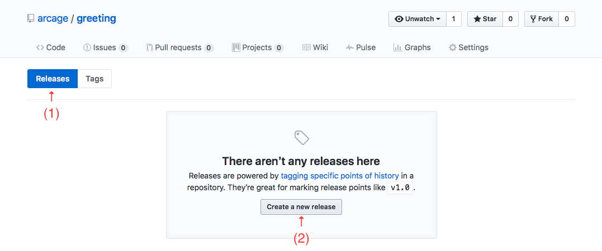

Title: Shardを作ろう
Author: AKJ / @arcage

# ShardsとShard

RubyにGemsがあるように、Crystalにも[Shards](https://github.com/crystal-lang/shards)（シャーズ）というパッケージ管理の仕組みが用意されています。以前はShards単体をCrystal本体とは別にインストールしなければならない時期もありましたが、Crystal v0.8.0からコンパイラ標準のライブラリ依存関係の管理ツールとして採用されたこともあり、最近では（少なくともmacOS用のhomebrewやLinux向けに公式で用意されているパッケージからインストールされた場合には）Crystal本体をインストールすればShardsもセットで利用できるようになっています。

Shardsは、Gemsと同じく言語本体に標準添付されていないライブラリをインターネットなどから取得して使えるようにしてくれます。このときGemsによってインストールされる個々のライブラリがGemと呼ばれるように、Shardsによってインストールされる個々のライブラリをCrystalではShard（シャード）(注:「Shard」は「石や陶器などの破片/かけら」といった意味。)と呼びます。ただし、CrystalにおけるShardsの役割は、Rubyに対するGemsのそれと完全に同一ではありません。例えば、Gemsが基本的にRubyインタプリタのグローバルな環境にGemをインストールするのに対して、Shardは個々のプロジェクトフォルダ内にShardをインストールします。インストールするShard特定のバージョンに限定したり、開発環境にだけインストールして本番環境にはインストールしないShardを指定することもできます。そうした点では、ShardsはRubyにおけるGems+Bundlerに相当する機能を担っていると言って良いかもしれません(注:Shards本体にはShardの検索機能は実装されていませんが、Shardを検索できる[CrystalShards](http://crystalshards.xyz)や、有用なShardへのリンクを集めた[Awesome Crystal](https://github.com/veelenga/awesome-crystal)といったサイトが利用可能です。)。

## なぜShardを公開するの？

さて、本章は自作ライブラリを積極的にShardとして公開することを勧める内容になっています。おそらくShardsが非常に有用な仕組みであることはご理解いただけると思いますが、では自作のライブラリをわざわざShardとして公開する理由は何でしょう？

もちろん「世界中のCrystal使いの人々に便利な機能を提供したい」というモチベーションもありでしょうが、そこまで肩肘を張らず「自分が便利だから」というだけの理由でも自作のライブラリをShardとして公開する理由としては十分です。実際、たとえ自分だけしか使わないかもしれないライブラリであっても、複数のプロジェクトで共通して使用する汎用部品は、Shardとして公開しておくことでデプロイ時の手間やその後のメンテナンスをかなり省力化することが可能です。

例えば、ライブラリを開発環境とは別の複数の本番環境で使用したい場合などでは、プロジェクトディレクトリをtarで固めてscpで転送してから展開、なんてことをしがちです。こうした作業はただでさえ手間がかかりますが、使用するライブラリのバージョンが異なる複数のプロジェクトを維持していこうと思うと気が遠くなります。しかし、ライブラリをShardとして公開しておけば、新しいプロジェクトディレクトリ内で`shard.yml`ファイルに2〜3行追加して`crystal deps`コマンドを実行するだけで必要なファイル一式が本番環境にインストールされます。また、必要であれば個々のプロジェクトごとに過去のバージョンを指定してインストールすることもできます。

このことだけを取ってみても、自作ライブラリをShard化しておくメリットはあると言えるのではないでしょうか。

## Shardを公開するのって難しくない？

「プログラミング言語の拡張ライブラリを公開する」というと敷居が高く感じる方もみえると思いますが、CrystalのShardを公開する手順は非常にシンプルです。実際、Crystalコンパイラの機能で作成した雛形をベースにコードを書いて、特に何も考えずにそのままGitHubへ公開するだけで、とりあえずShardとして利用できてしまう場合もあります。

とはいえ、ある程度はShardの体裁といったものもありますので、ここでは、公開リポジトリでShardを公開する際の最低限の手順について説明したいと思います。

# Shardの作り方

では、自作ライブラリをShardとして公開し、別のプロジェクトから使うまでの大雑把な流れを見てみましょう。

なお、ここではShardの公開先としてGitHubを利用する場合について、以下のような環境を想定して説明しています。個々の操作の詳細（UNIXのShellコマンドやGitHub関係の操作など）は各自で確認をお願いします。

- 作業環境にCrystal(ここではv0.21.0を使用)がインストールされている
- 作業環境にGitがインストールされており、`user.name`や`user.email`が設定されている
- GitHubにアカウントを持っており、GitHub関係の操作を一通り把握している

## ライブラリの機能と名前を考える

まず最初にどんな機能のライブラリを、どんな名前のShardとして公開するのかを決めなければいけません。機能については「とにかく自分がやりたいこと」なので自ずから決まってくるものですが、名前については意外と悩みどころです。

いくつかのShardを見てみると、機能をそのまま表した名前にするパターンと、機能とは関係なくプロダクトイメージで独自の名前をつけるパターンの2種類が混在しています。どちらが良い悪いという話ではありませんが、大まかな傾向として、単機能とは言わないまでも何か1つに焦点を絞ったShardは機能そのままの名前（[`mysql`](https://github.com/crystal-lang/crystal-mysql)や[`html_builder`](https://github.com/crystal-lang/html_builder)など）を、フレームワークなど複数の機能から構成されているShardは独自の名前（[`kemal`](https://github.com/kemalcr/kemal)や[`topaz`](https://github.com/topaz-crystal/topaz)など）を持つものが多いようです。

また、`shard.yml`の記述方法を定義した「[`shard.yml` specification.](https://github.com/crystal-lang/shards/blob/master/SPEC.md)」では、Shardの名前として以下のような命名規則が明記されています。

- 他のShardと重複しないこと
- 50文字以下であること
- 英小文字（`a-z`）を使用すべき
- 名前の一部に`crystal`を含むべきではない
- 数字（`0-9`）を含んでも良いが、先頭に置いてはならない
- アンダースコア（`_`）やダッシュ（`-`）を含んでも良いが、先頭や末尾に置いてはならない
- アンダースコアやダッシュが連続してはならない

Shard名の重複については、とりあえず自分で使う前提であればあまり厳密に考えなくても問題になることは少ないでしょう。単機能のShard名は割とカブりがちですし、誰も使っていないことを確認することは実際問題不可能です。とはいえ、少なくとも標準添付のライブラリとカブるような名前は避けなければいけませんし、とりあえず「[CrystalShards](http://crystalshards.xyz/)」で検索くらいはしてみても良いかもしれません。

また、上記の命名規則ではダッシュ記号も使えることになっていますが、特にどうしてもという理由がないのであれば、基本的にShard名は英小文字の単語を使用し、複数の単語を含む場合はアンダースコアで繋ぐスネークケース（アンダースコアケース）での指定をオススメします。なぜかというと、Shard名はソースコードのファイル名にも使用されることになるのですが、[Crystal公式ドキュメントのコーディングスタイル](https://crystal-lang.org/docs/conventions/coding_style.html)では、ソースコードを記述するファイルのパスは名前空間に合致させ、ファイル名としてクラス名をスネークケースに変換したものを使用するよう推奨しているためです。（例: `HTTP::WebSocket` -> `src/http/web_socket.cr`）

ちなみに、同コーディングスタイルでは、型名（クラス名、モジュール名、構造体名）として複数の単語を先頭文字のみ大文字にしてそのまま連結したキャメルケース（アッパーキャメルケース）を使用することが推奨されています(注:`HTTP`のような略語は全て大文字を使用する。)。次項で紹介するプロジェクト雛形の自動生成では、指定されたプロジェクト名がShard名であると想定して、プロジェクト名をキャメルケースへ変換した名前でモジュール等が定義されます。この点からもShard名はスネークケースで付けておくと便利です。

さて、ここでは「相手の名前を与えると簡単な挨拶文を返す」だけの機能を持った`Greeting`モジュールを提供するShard `greeting`を作ってみることにしましょう。以降はプロジェクト名（Shard名）として`greeting`が指定されたものとして説明しますので、自身のライブラリを作る際は`greeting`や`Greeting`といった単語を適当に読み替えてください。

## ライブラリの雛形を作る

Crystalのソースコードをコンパイルするのに使用する`crystal`コマンドには、それ以外にも多くの機能が実装されています。ライブラリやアプリケーションのプロジェクト雛形を生成する `crystal init app|lib プロジェクト名` もその一つで、カレントディレクトリの直下にプロジェクト名をディレクトリ名としたプロジェクトディレクトリが生成されます(注:`init`に続くパラメータが`app`であれば単体アプリケーション用の雛形が、`lib`であればライブラリ用の雛形が生成されます。)。

    !!!cmd
    (注:ライブラリ用雛形の生成)
    $ crystal init lib greeting
          create  greeting/.gitignore
          create  greeting/LICENSE
          create  greeting/README.md
          create  greeting/.travis.yml
          create  greeting/shard.yml
          create  greeting/src/greeting.cr
          create  greeting/src/greeting/version.cr
          create  greeting/spec/spec_helper.cr
          create  greeting/spec/greeting_spec.cr
    Initialized empty Git repository in (CWD)/greeting/.git/
    $ cd greeting
    (greeting)$

なお、以降に登場する操作やファイルパスは、ここで作成されたプロジェクトディレクトリ`greeting`の直下にいることを想定して説明していきます。

## ライブラリの機能を実装する

何はともあれ、まずはライブラリ本体の機能を実装しなければいけませんが、最近ではテスト駆動開発（test-driven development; TDD）や振舞駆動開発（behavior driven development; BDD）が流行りのようです。プロジェクト雛形に予めユニットテスト用の構成が含まれていたり、ユニットテスト実行機能（`crystal spec`コマンド）がコンパイラに標準で用意されていたりするところからして、Crystalの流儀としてはこうした開発方式が推奨されているようにも思えます。

この文書を書いている人間自身、Crystalに触れるまであまりちゃんとテストを意識したことがなかったりしますが、ここではひとまずその流れに沿って`Greeting`モジュールの実装をしてみましょう。

### ユニットテスト用のテストケースを書く

ユニットテストの基本的な考え方は、予め「このメソッドがこういう呼び出され方をしたら、出力はこうなるはず」という条件（テストケース）を列記しておき、実装されたコードが実際にそのような動きをするかを逐一チェックするイメージです。

BDDでは、まず実装しようとするライブラリが外部に公開するインタフェース（パブリックなメソッドの引数、返り値など）の入出力条件をテストケースとして定義してから、そのテストケースを使用したユニットテストが通るようにソースコードを記述する、という流れで開発を行います。したがって、まず最初にすべきはテストケースの記述、ということになります。

先ほど`greeting`用プロジェクトの生成時に用意された`spec/greeting_spec.cr`には、以下のようなテストケースが記述されていました。

    (注:spec/greeting_spec.cr（雛形生成時）)
    require "./spec_helper"

    describe Greeting do
      # TODO: Write tests

      it "works" do
        false.should eq(true) (注:テストケース)
      end
    end

ここで定義されているテストケースは「`fales`は`true`と等しい」というものなので、当然ながらこの状態でユニットテスト（`crystal spec`コマンド）を実行しても必ず失敗します。ですので、まずは`spec/greeting_spec.cr`内に必要なテストケースを記述してみましょう。

テストケースの書き方についてはあまりまとまったドキュメントがないのですが、ユニットテスト実行時には全てのオブジェクトに`#should`と`#should_not`メソッドがインクルードされており、[`Spec::Expectations`モジュールのインスタンスメソッド](https://crystal-lang.org/api/Spec/Expectations.html)を引数として与えると、与えられた条件にしたがって結果のチェックが行われるようなイメージです。

というわけで、「`Greeting.hello("John")`が`"Hello, John!"`を返す」というだけのテストケースはこんな感じになります(注:この時点ではまだライブラリ本体に`Greeting.hello`が実装されていないため、ユニットテストを実行しても「そんなメソッドは無ぇ!!」と怒られます。)。

    (注:spec/greeting_spec.cr（テスト内容記述後）)
    require "./spec_helper"

    describe Greeting do
      describe ".hello" do
        it "returns greeting string for name." do
          Greeting.hello("John").should eq("Hello, John!")
        end
      end
    end

必要なテストケースが書けたら、次はライブラリ本体の実装です。

### ライブラリ本体のコードを書く

ライブラリの本体機能は`src/`ディレクトリ以下に記述します。`greeting`を利用する際に最初に読み込まれるソースコード`src/greeting.cr`はプロジェクト雛形の生成時に用意されています。

    (注:src/greeting.cr（雛形生成時）)
    require "./greeting/*"

    module Greeting
      # TODO Put your code here
    end

シンプルな機能のライブラリであればこの`# TODO Put your code here`の部分に直接コードを記述してしまっても良いですし、複数のクラスやモジュールから構成されるような場合には、モジュールやクラス毎にソースファイルを分割して`src/greeting`ディレクトリ配下に置いても構いません。

今回はパブリックなクラスメソッドが1つだけという非常にシンプルな構造ですので、`src/greeting.cr`に直接コードを記述してみます。

    (注:src/greeting.cr（機能実装後）)
    require "./greeting/*"

    module Greeting
      # returns greeting message.
      def self.hello(name : String)
        "Hello, #{name}."
      end
    end

### テストを通す

機能が実装できたので、先ほど定義しておいたテストを実行してみます。

    !!!cmd
    (注:テスト実行結果)
    (greeting)$ crystal spec
    F (注:失敗!!)

    Failures:

      1) Greeting .hello returns greeting string for name.
         Failure/Error: Greeting.hello("John").should eq("Hello, John!")

           expected: "Hello, John!" (注:テストが期待した結果)
                got: "Hello, John." (注:実際の結果)

         # spec/greeting_spec.cr:6

    Finished in 733 microseconds
    1 examples, 1 failures, 0 errors, 0 pending

    Failed examples:

    crystal spec spec/greeting_spec.cr:5 # Greeting .hello returns greeting string for name.
    (greeting)$

おっと、テストに失敗してしまいました。

テスト結果には、`Greeting.hello("John")`がテストケースで定義された`"Hello, John!"`ではなく`"Hello, John."`を返している、と出ています。先ほどのソースコードを見直してみると、確かに返す文字列の最後が`"!"`ではなく`"."`になっていますね。この部分のソースコードを以下のように修正して再度テストを実行してみます。

    (注:src/greeting.cr（バグ修正後）)
    require "./greeting/*"

    module Greeting
      # returns greeting message.
      def self.hello(name : String)
        "Hello, #{name}!"
      end
    end

今度は問題なくテストを通過できました。

    !!!cmd
    (注:ソース修正後のテスト実行結果)
    (greeting)$ crystal spec
    . (注:成功!!)

    Finished in 922 microseconds
    1 examples, 0 failures, 0 errors, 0 pending
    (greeting)$


こうして、全ての（といっても1つだけですが）テストケースを通過できたことで、`greeting`が当初の設計通りに実装されていることを確認できました。

## Shardとしての体裁を整える

「ライブラリの機能は実装できた」「テストも通った」となれば、とりあえずGitHubへ公開しさえすれば、他のプロジェクトからShardとして再利用すること自体は可能です。とはいえ、GitHubなどのパブリックリポジトリとして公開する場合には、プロジェクト雛形生成時に一緒に作成される`LICENSE`、`README.md`、`shard.yml`などを整理して、Shardとして最低限の体裁は整えておくと良いでしょう。

とはいっても、gitコマンド用の`user.name`や`user.email`が設定されていれば、`LICENSE`と`shard.yml`については必要に応じてそれらの内容が各所へ自動的に埋め込まれますので、「公開ライセンスをデフォルトのMITライセンスから変更したい」とか「自作ライブラリが他のShardに依存している」とかがなければこれらのファイルは修正する必要がないかもしれません。

一方、`README.md`だけはどうしても何箇所か手を入れる必要があります。このファイルはMarkdown形式で記述されたいわゆる「READMEファイル」で、予めGitHubでプロジェクトのトップページに表示されることを想定したテンプレートが用意されています。

    (注:README.mdファイル（雛形生成時）)
    # greeting

    TODO: Write a description here

    ## Installation

    Add this to your application's `shard.yml`:

    ```yaml
    dependencies:
      greeting:
        github: [your-github-name]/greeting
    ```

    ## Usage

    ```crystal
    require "greeting"
    ```

    TODO: Write usage instructions here

    ## Development

    TODO: Write development instructions here

    ## Contributing

    1. Fork it ( https://github.com/[your-github-name]/greeting/fork )
    2. Create your feature branch (git checkout -b my-new-feature)
    3. Commit your changes (git commit -am 'Add some feature')
    4. Push to the branch (git push origin my-new-feature)
    5. Create a new Pull Request

    ## Contributors

    - [[your-github-name]](https://github.com/[your-github-name]) AKJ - creator, maintainer

基本的には`[your-github-name]`となっている箇所をShardの公開に使用するGitHubのアカウント名に置き換えて、`TODO: Write 〜`となっている辺りを埋めればREADMEは完成です。さしあたり自分一人でメンテするつもりであれば、`## Development`や`## Contributing`などは削除してしまうという選択もありだと思います。

というわけで、`README.md`ファイルはこんな感じに手を入れてみました。

    (注:README.mdファイル（編集後）)
    # Greeting

    Hello, guys!

    ## Installation

    Add this to your application's `shard.yml`:

    ```yaml
    dependencies:
      greeting:
        github: arcage/greeting
    ```

    ## Usage

    ```crystal
    require "greeting"

    Greeting.hello("John") #=> "Hello, John!"
    ```

    ## Contributors

    - [arcage](https://github.com/arcage) AKJ - creator, maintainer

## ライブラリをGitHubへ公開する

Shardとしての体裁も整ったら、雛形生成時に用意された空のgitリポジトリに変更内容を反映させてGitHubへ公開します。

この操作については、Shellでコマンドを叩く形でも、GUI付きのgitアプリケーションを利用する形でも、普段使用している手順で行ってください。

GitHubにリポジトリが公開されれば、Shardとして利用するための準備は完了です。


# Shardの使い方

さて、`greeting`は無事に公開されました。

では次に、簡単なコマンドラインアプリケーションを例に、他のプロジェクトから`greeting`を使用する手順をみてみましょう。

ここでは、標準入力から1行に付き1つずつ受け取る名前に対して標準出力へ挨拶文を出力する`hello`コマンドを作ってみます。

## Shardを使用するプロジェクトの雛形を作る

まず最初に、Shardを作った時と同様に`crystal init`コマンドでプロジェクトの雛形を作ります。今回はライブラリではなくコマンドラインアプリケーションを作りますので、`crystal init lib hello`ではなく`crystal init app hello`としてアプリケーション用のプロジェクト雛形を生成します。

`crystal init app`も`crystal init lib`も、生成されるファイル構成はほぼ同じですが`shard.yml`ファイルなどの内容が微妙に異なっています。

## `shard.yml`に使いたいShardの記述を追加

`hello`プロジェクトで`greeting` Shardを使用することを明示するためには、`greeting`のREADMEで指示されている以下の内容を`hello`プロジェクト側の`shard.yml`に追加する必要があります。

    (注:greetingを使うための記述)
    dependencies:
      greeting:
        github: arcage/greeting

もし複数のShardを使用する場合、`dependencies`を複数記述するのではなく、同じ`dependencies`の下に複数のShardについての記述を並べてください。

    (注:複数のShardを使用する場合)
    dependencies:
      shard1:
        github: user1/shard1
      shard2:
        github: user2/shard2

## Shardをインストールする

`shard.yml`で指定されたShardをプロジェクトディレクトリ内へインストールするには、プロジェクトディレクトリで`crystal deps`コマンドを実行します。

    !!!cmd
    (hello)$ crystal deps
    Updating https://github.com/arcage/greeting.git
    Installing greeting (HEAD)
    (hello)$

`shard.yml`指定したShardが別のShardを使用していた場合も、`crystal deps`コマンド一発で必要なShardを芋づる式に全てインストールしてくれます。

## Shardを使ってコードを書く

Shardの機能をコード内で使用するには、READMEで指定された形でShardをrequireする必要があります。今回は`src/hello.cr`の中にコマンドの挙動も全て実装してしまいますので、その先頭でrequireしておきましょう。

本来ならちゃんとテストケースを書いてから機能の実装に入るところですが、紙面の都合もありますのでその辺りは省略して、とりあえずでき上がったソースコードがこんな感じ。

    (注:src/hello.cr)
    require "greeting"
    require "./hello/*"

    module Hello
      def self.run(input : IO = ARGF, output : IO = STDOUT)
        input.each_line do |name|
          output.puts Greeting.hello(name)
        end
      end
    end

    Hello.run

## コンパイルして実行してみる

ソースコードを実行ファイルにコンパイルするには`crystal build`コマンドを使用します。

    !!!cmd
    (hello)$ crystal build src/hello.cr
    (hello)$

コンパイル中にエラーが発生しなければ、ワーキングディレクトリにソースファイルのベースネーム（この場合`hello`）と同じ名前の実行ファイルができているはずです。

でき上がった実行ファイルへ、試しにパイプ経由で2行の入力を与えてみると、ソースコードの実装通り`Greeting.hello`の出力が2回行われました。

    !!!cmd
    (hello)$ echo -e "John\nBob" | ./hello
    Hello, John!
    Hello, Bob!
    (hello)$

# Shardのバージョン管理

Shardのバージョン番号は必ず数字を含んでいなければならず、またダッシュ（-）やピリオド（.）を含んでも構いませんがそれらは連続しては使用できません（どうやら英文字は含んでも良いようです）。また、バージョン番号は[セマンティックバージョニング](http://semver.org/lang/ja/)のような、一貫性のあるルールに則って付けることを強く推奨されています（例：「0.0.1」「1.2.3」「2.0.0-rc1」など）。

Shardのバージョンを表す情報として、プロジェクトファイルの中にもソースコード（`src/greeting/version.cr`）内で定義されている定数`Greeting::VERSION`や、`shard.yml`のトップレベルに置かれた`version`などがありますが、それらの他にGitリポジトリ側のリリースごとに付けられたタグ情報（以下、バージョンタグ）も利用されます。

このうち、`crystal deps`コマンドによってShardのバージョンとして認識される（バージョンを指定してShardをインストールする際などに利用される）のは、最後のバージョンタグのようです。ですので、Shardのバージョンを上げて`Greeting::VERSION`や`shard.yml`内の`version`を変更した場合には、Gitリポジトリ側でもバージョンタグを付けておくことをオススメします。

ちなみに、プロジェクト雛型の生成時には、定数`Greeting::VERSION`と`shard.yml`内の`version`項目には初期バージョン番号として「0.1.0」が設定されています。

## バージョンタグの付け方

バージョンタグをつけるためにはGitHubでプロジェクトのリリース操作を行う必要があります。

まず、GitHub上に公開したShardのリポジトリトップページで「Code」タブを表示し、上部に表示されている「X releases」(一度もリリースを行っていない場合 X=0)をクリックしてリリース（タグ）管理画面に遷移します。


リポジトリをGitHubへ公開したばかりの状態だと当然ですが何も表示されませんので、左上の「Release/Tag」セレクタ(1)で「Release」が選択されていることを確認し、「Create A new release」ボタン(2)をクリックして新しいバージョンタグの作成画面へ遷移します。



ここでは、まずタグ名として先頭に小文字の「v」を付けたバージョン番号（バージョン「0.1.0」なら「v0.1.0」）を指定し(1)、続いてどのブランチをリリース対象とするかを選択(2)、リリースにタイトルを付けます(3)。説明文(4)はとりあえず空でもリリース可能ですが、バージョンアップの際などには変更内容などを簡単に記述しておくと良いでしょう。また、「This is a pre-release」チェックボックス(5)にチェックを入れておくと、このリリースが安定版でないことを明示することができます。これらの設定が完了したら、「Publish Release」ボタン(6)をクリックしてリリースを公開しましょう。


これで新しいリリースが追加されました。前の画面で「This is a pre-release」チェックボックスにチェックを入れてあれば、リリース表示のかなり目立つ場所に「Pre-release」マークが表示されます。


このようにして、GitHub上でバージョンタグが設定されているShardでは、利用するプロジェクト側にインストールした際にもバージョン番号が認識されるようになります。

    !!!cmd
    (注:バージョンタグ設定済みのShardの場合)
    (hello) $ crystal deps
    Updating https://github.com/arcage/greeting.git
    Installing greeting (0.1.0) (注:HEADではなくバージョン番号が認識されている)

この後は、リリース（タグ）管理画面右上の「Draft a new release」ボタンから新しいリリースを作成することができるようになります。


## 特定バージョンのShardを使う

Shard側がバージョンタグをつけてくれていれば、使用する側のプロジェクトで特定のバージョンを指定してインストールすることができます。

    (注:greeting v0.1.0を使うための記述)
    dependencies:
      greeting:
        github: arcage/greeting
        version: 0.1.0

また、バージョン番号の前に`>` 、`>=`、`<`、`<=`などの演算子を加えると、指定したバージョンより新しい/古いといった指定も可能です。

    (注:v0.1.0以上を使うためのバージョン指定)
    version: >= 0.1.0

このほかに`~>`演算子がありますが、これは以下のようなやや変わった指定になります。

    (注: ~> 演算子の挙動)
    version: ~> 1.0.2 (注: >= 1.0.2 かつ < 1.1.0)
    version: ~> 2.1 (注: >= 2.1 かつ < 3.0)

バージョンタグが適切につけられていれば、Shardのバージョンが上がった際のAPIの変更によって自分の書いたコードが最新版のShardではうまく動かなくなってしまったような場合に、過去のバージョンを明示して利用することができるようになり非常に便利です。

# おわりに

以上、筆者の理解できている範囲でざっくりとShardの公開手順を説明してみました。

「誰かに使ってもらおう」と思うとShard公開への心理的なハードルが高くなりガチですが、「誰も使わないかもしれないけれど自分が便利だから」と割り切ってしまうと、意外と簡単にそのハードルを乗り越える（もしくは下をくぐり抜ける）ことができるのではないかと思います。少なくとも自分はそうでした。また、実際に試してもらえれば、驚くほど簡単にShardを公開できることがご理解いただけるはずです。

あと、Shardsにはここでは紹介できなかった機能がいくつもありますので、先に紹介した「`shard.yml` specification.」を一度じっくり読んでみてください。きっとお役に立ちますよ。

ということで、皆さんも自作ライブラリをShardとして公開してみてはいかがでしょうか。
